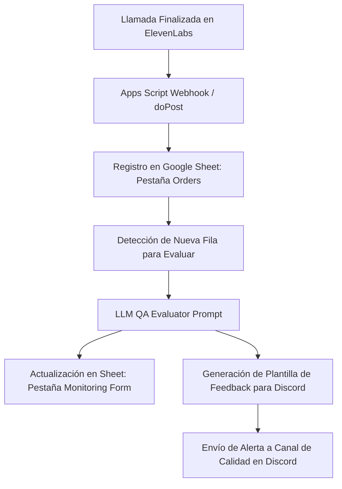

# 📋 Plan de Acción: Automatización de Calidad (QA) con Inteligencia Artificial
**Proyecto**: Wine Country Gift Baskets (WGCB) — Evaluador de Calidad Conversacional
**Destinatario**: André Arenas
**Remitente**: Departamento de Calidad & BPO Automation (Telat Group)

Este documento define la arquitectura, criterios de evaluación y el flujo de integración técnica para automatizar el monitoreo de llamadas (QA) de la campaña **Wine Country Gift Baskets**, utilizando los registros de transcripción generados por la IA de voz de ElevenLabs.

---

## 🏛️ 1. Arquitectura del Flujo de Automatización de QA

El proceso está diseñado para operar de manera asíncrona sobre la base de datos de órdenes y transcripciones de llamadas:



1. **Ingesta de Datos**: Al terminar una llamada (Inbound o Outbound), ElevenLabs envía un webhook con la transcripción completa (`transcript`) y las variables extraídas.
2. **Evaluación de QA (LLM)**: Un script de Google Apps Script o un microservicio Node.js toma la transcripción y ejecuta una llamada a la API de un Modelo de Lenguaje (LLM) estructurada con un prompt del sistema estricto.
3. **Registro de Resultados**: El resultado JSON estructurado del LLM se escribe en la hoja de cálculo de Monitoreo de Calidad.
4. **Despacho de Alertas**: Se genera el mensaje formateado para Discord y se despacha vía webhook para retroalimentación del supervisor.

---

## 🎯 2. Mapeo de Criterios de Evaluación (Checklist QA)

El LLM evaluará la transcripción según los **8 puntos clave** establecidos en el formato de auditoría:

| # | Criterio de Auditoría | Regla de Validación del LLM | Estado (Yes/No) |
|---|---|---|---|
| **1** | ¿El agente seleccionó la cuenta correcta o ingresó la nueva información de manera precisa? | Evaluar si el agente recopiló nombre del comprador, correo y teléfono, y si deletreó los datos críticos para confirmación. | Boolean |
| **2** | ¿El agente solicitó e ingresó el código de catálogo correcto? | Validar si se mencionó algún código promocional o de catálogo como `FOODP` (comida), `WINEP` (vino) o el descuento `C`. | Boolean |
| **3** | ¿El agente ingresó la información del destinatario correctamente y deletreó todos los nombres? | Verificar en la transcripción que el agente deletreó explícitamente el nombre del destinatario y la dirección de envío. | Boolean |
| **4** | ¿El agente mencionó y aplicó el nombre del artículo y el precio correcto? | Confirmar que el agente repitió el artículo seleccionado (ej. Canasta de Comida #000) y su respectivo costo base ($75.00 o $95.00 USD). | Boolean |
| **5** | ¿El agente leyó todas las advertencias/ventanas emergentes pertinentes? | Validar que se leyó la advertencia de firma de adulto (21+) para alcohol o las advertencias logísticas de Alaska/Hawaii. | Boolean |
| **6** | ¿El agente leyó el mensaje de regalo, deletreó nombres y verificó que fuera exacto? | Confirmar que el agente leyó en voz alta el mensaje de la tarjeta y explícitamente confirmó nombres propios incluidos en el mensaje. | Boolean |
| **7** | ¿El agente cerró la llamada correctamente proporcionando el número de orden y el total? | Validar que al final de la llamada el agente le dio al cliente su número de confirmación (Call ID) y el costo total final calculado. | Boolean |
| **8** | ¿El cliente se mostró satisfecho al final de la llamada? | Realizar un análisis de sentimiento sobre el cierre de la conversación para evaluar frustración o satisfacción. | Boolean |

### Criterio de Aprobación (Pass/Fail)
- **Aprobado (Pass)**: Requiere cumplimiento del **100%** en puntos de cumplimiento crítico (Puntos 1, 3, 5 y 6) y un puntaje general mínimo de **7/8**.
- **Reprobado (Fail)**: Cualquier falla en puntos críticos (ej. no leer advertencia de firma de adulto en canasta de vino, o no deletrear direcciones/nombres) resulta en desaprobación inmediata.

---

## 📝 3. Generación Automatizada del Feedback (Plantilla Discord)

El evaluador de IA debe estructurar el JSON de salida con dos campos de texto libre para mapear exactamente al formato de retroalimentación semanal de calidad:

### A. Áreas de Oportunidad (Areas for Improvement)
El LLM debe listar viñetas específicas con lo que el agente omitió o hizo de manera incorrecta. Ejemplos automatizados basados en fallas de los criterios:
- *"No se deletreó el nombre del destinatario o el comprador durante la llamada."*
- *"Omitió mencionar que las canastas con vino requieren una firma de adulto (mayor de 21 años) para ser entregadas."*
- *"No se proporcionó el número de orden o el total de la compra en la sección de cierre de la llamada."*
- *"Faltó empatía o confirmación activa al recibir datos complejos de dirección."*

### B. Resumen General (Overall Summary)
Un resumen equilibrado de la interacción que resalte tanto los puntos positivos como los recordatorios de coaching:
- *Positivos*: *"El agente mantuvo un tono profesional y fluido, resolvió con rapidez las dudas del cliente sobre el recargo de Alaska y aplicó el descuento del 5% sin fricciones."*
- *Recordatorios*: *"Asegúrate de deletrear siempre los nombres propios en el mensaje de regalo para evitar errores de impresión en la tarjeta de felicitaciones."*

---

## 🛠️ 4. Estructura del Prompt del Sistema para el Evaluador IA

Para programar el evaluador de IA (LLM), André Arenas debe implementar un prompt del sistema estructurado para retornar un esquema JSON limpio. Se adjunta la plantilla recomendada del prompt:

```text
Eres un auditor de calidad (QA Monitor) experto en centros de contacto para Telat Group. Tu tarea es analizar de forma imparcial la transcripción de una llamada entre un "Gift Consultant" (agente) y un cliente de la campaña "Wine Country Gift Baskets".

Evalúa la transcripción provista basándote estrictamente en los siguientes criterios. Debes responder exclusivamente en formato JSON utilizando el esquema definido abajo.

Esquema de salida JSON:
{
  "call_id": "string",
  "checklist": {
    "1_buyer_info_correct": { "achieved": boolean, "comment": "string" },
    "2_catalog_code_entered": { "achieved": boolean, "comment": "string" },
    "3_recipient_info_accurate": { "achieved": boolean, "comment": "string" },
    "4_item_price_mentioned": { "achieved": boolean, "comment": "string" },
    "5_popups_warnings_read": { "achieved": boolean, "comment": "string" },
    "6_gift_message_uppercase": { "achieved": boolean, "comment": "string" },
    "7_closing_order_total": { "achieved": boolean, "comment": "string" },
    "8_customer_satisfaction": { "achieved": boolean, "comment": "string" }
  },
  "score": "integer (0-8)",
  "result": "string (Pass / Fail)",
  "discord_feedback": {
    "areas_for_improvement": [
      "string (lista detallada de fallas u omisiones específicas)"
    ],
    "overall_summary": "string (resumen constructivo detallando fortalezas y aspectos a corregir)"
  },
  "notes_coaching": "string (oportunidades de desarrollo para el supervisor de operaciones)"
}

Reglas específicas de negocio:
- Si la canasta contiene vino (Item #002) y no se leyó la advertencia de firma de adulto (21+), el Criterio 5 es "false" y el resultado final es "Fail" automáticamente.
- Si no se deletreó el nombre o correo del comprador, el Criterio 1 es "false".
- Si no se deletreó el nombre del destinatario, el Criterio 3 es "false".
- El resultado es "Pass" si y solo si la puntuación es >= 7 y no hay fallas críticas en los criterios 1, 3, 5 y 6.
```

---

## 🔗 5. Estructura de Datos y Conexión de Hojas (Pestaña "Monitoring Form")

Para que André conecte el resultado de calidad con Google Sheets, se debe crear la pestaña `MonitoringForm` estructurada con las siguientes columnas para que reciba el JSON de salida:

1. **Fila 1 (Encabezados de Control)**: `ID Evaluación`, `Fecha Evaluación`, `Call ID`, `Agente (GC Name)`, `Auditor (QA Monitor)`, `Puntaje (Score)`, `Resultado (Pass/Fail)`.
2. **Columnas de Criterios (Fórmula o Registro)**: `P1_BuyerInfo`, `P2_Catalog`, `P3_Recipient`, `P4_ItemPrice`, `P5_Popups`, `P6_GiftMsg`, `P7_Closing`, `P8_Satisfaction`.
3. **Retroalimentación**: `Áreas de Oportunidad`, `Resumen General`, `Notas de Coaching`.
